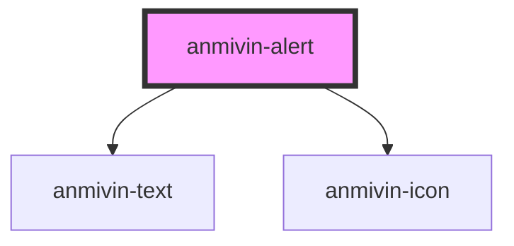

# anmivin-alert

<!-- Auto Generated Below -->

## Properties

| Property     | Attribute    | Description | Type      | Default     |
| ------------ | ------------ | ----------- | --------- | ----------- |
| `alertcolor` | `alertcolor` |             | `string`  | `undefined` |
| `alerttitle` | `alerttitle` |             | `string`  | `undefined` |
| `isopen`     | `isopen`     |             | `boolean` | `undefined` |

## Events

| Event       | Description | Type               |
| ----------- | ----------- | ------------------ |
| `closAlert` |             | `CustomEvent<any>` |

## Dependencies

### Depends on

- [anmivin-text](../anmivin-text)
- [anmivin-icon](../anmivin-icon)

### Graph

----------------------------------------------

*Built with [StencilJS](https://stenciljs.com/)*
