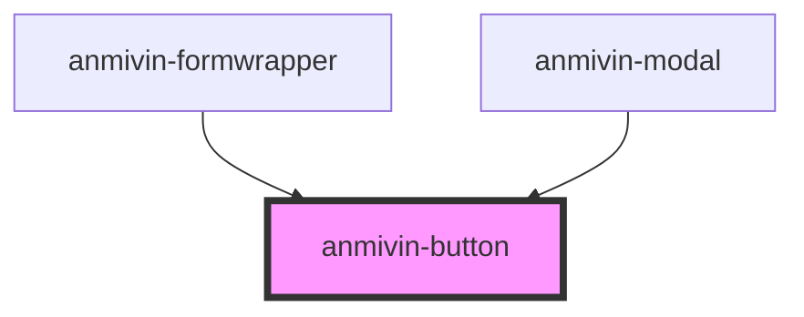

# anmivin-button

<!-- Auto Generated Below -->

## Properties

| Property      | Attribute     | Description | Type                                                                                 | Default     |
| ------------- | ------------- | ----------- | ------------------------------------------------------------------------------------ | ----------- |
| `buttoncolor` | `buttoncolor` |             | `string`                                                                             | `undefined` |
| `size`        | `size`        |             | `sizes.Extralarge \| sizes.Extrasmall \| sizes.Large \| sizes.Medium \| sizes.Small` | `undefined` |
| `type`        | `type`        |             | `string`                                                                             | `undefined` |
| `variant`     | `variant`     |             | `"flat" \| "pressed"`                                                                | `undefined` |

## Dependencies

### Used by

 - [anmivin-formwrapper](../anmivin-formwrapper)
 - [anmivin-modal](../anmivin-modal)

### Graph

----------------------------------------------

*Built with [StencilJS](https://stenciljs.com/)*
