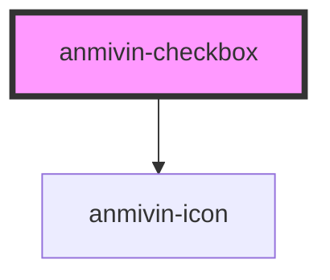

# anmivin-checkbox

<!-- Auto Generated Below -->

## Properties

| Property        | Attribute       | Description | Type      | Default     |
| --------------- | --------------- | ----------- | --------- | ----------- |
| `checkboxcolor` | `checkboxcolor` |             | `string`  | `undefined` |
| `checked`       | `checked`       |             | `boolean` | `false`     |
| `formlabel`     | `formlabel`     |             | `string`  | `undefined` |
| `label`         | `label`         |             | `string`  | `undefined` |

## Events

| Event              | Description | Type                                              |
| ------------------ | ----------- | ------------------------------------------------- |
| `inputValueChange` |             | `CustomEvent<{ value: boolean; label: string; }>` |

## Dependencies

### Depends on

- [anmivin-icon](../anmivin-icon)

### Graph

----------------------------------------------

*Built with [StencilJS](https://stenciljs.com/)*
