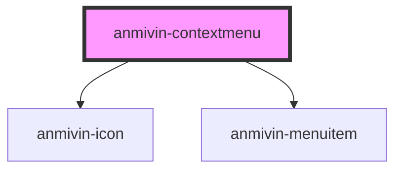

# anmivin-contextmenu

<!-- Auto Generated Below -->

## Properties

| Property     | Attribute    | Description | Type                                                             | Default     |
| ------------ | ------------ | ----------- | ---------------------------------------------------------------- | ----------- |
| `isopen`     | `isopen`     |             | `boolean`                                                        | `undefined` |
| `menuitems`  | `menuitems`  |             | `string \| ({ title: string; action: () => string \| void; }[])` | `undefined` |
| `modalcolor` | `modalcolor` |             | `string`                                                         | `undefined` |

## Dependencies

### Depends on

- [anmivin-icon](../anmivin-icon)
- [anmivin-menuitem](../anmivin-menuitem)

### Graph

----------------------------------------------

*Built with [StencilJS](https://stenciljs.com/)*
