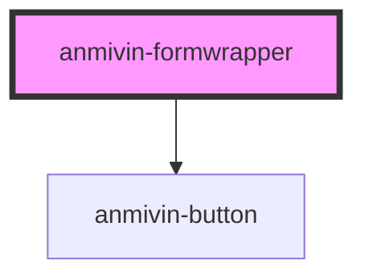

# anmivin-formwrapper

<!-- Auto Generated Below -->

## Properties

| Property      | Attribute     | Description | Type     | Default     |
| ------------- | ------------- | ----------- | -------- | ----------- |
| `buttoncolor` | `buttoncolor` |             | `string` | `undefined` |

## Events

| Event        | Description | Type               |
| ------------ | ----------- | ------------------ |
| `submitForm` |             | `CustomEvent<any>` |

## Dependencies

### Depends on

- [anmivin-button](../anmivin-button)

### Graph

----------------------------------------------

*Built with [StencilJS](https://stenciljs.com/)*
