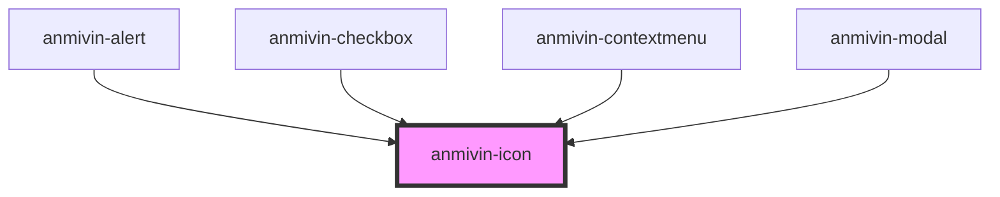

# anmivin-icon

<!-- Auto Generated Below -->

## Properties

| Property | Attribute | Description | Type     | Default         |
| -------- | --------- | ----------- | -------- | --------------- |
| `fill`   | `fill`    |             | `string` | `'transparent'` |
| `path`   | `path`    |             | `string` | `undefined`     |
| `size`   | `size`    |             | `number` | `24`            |
| `stroke` | `stroke`  |             | `string` | `'#000000'`     |

## Dependencies

### Used by

 - [anmivin-alert](../anmivin-alert)
 - [anmivin-checkbox](../anmivin-checkbox)
 - [anmivin-contextmenu](../anmivin-contextmenu)
 - [anmivin-modal](../anmivin-modal)

### Graph

----------------------------------------------

*Built with [StencilJS](https://stenciljs.com/)*
