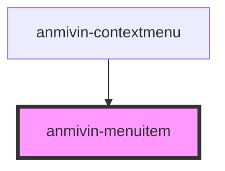

# anmivin-menuitem

<!-- Auto Generated Below -->

## Properties

| Property | Attribute | Description | Type     | Default     |
| -------- | --------- | ----------- | -------- | ----------- |
| `text`   | `text`    |             | `string` | `undefined` |

## Events

| Event    | Description | Type               |
| -------- | ----------- | ------------------ |
| `action` |             | `CustomEvent<any>` |

## Dependencies

### Used by

 - [anmivin-contextmenu](../anmivin-contextmenu)

### Graph

----------------------------------------------

*Built with [StencilJS](https://stenciljs.com/)*
