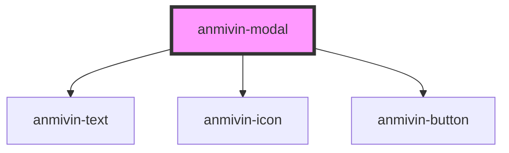

# anmivin-modal

<!-- Auto Generated Below -->

## Properties

| Property      | Attribute      | Description | Type      | Default     |
| ------------- | -------------- | ----------- | --------- | ----------- |
| `buttons`     | `buttons`      |             | `string`  | `undefined` |
| `cancelText`  | `cancel-text`  |             | `string`  | `'cancel'`  |
| `confirmText` | `confirm-text` |             | `string`  | `'confirm'` |
| `isopen`      | `isopen`       |             | `boolean` | `undefined` |
| `modalcolor`  | `modalcolor`   |             | `string`  | `undefined` |
| `modaltitle`  | `modaltitle`   |             | `string`  | `undefined` |

## Events

| Event         | Description | Type               |
| ------------- | ----------- | ------------------ |
| `closeModal`  |             | `CustomEvent<any>` |
| `submitModal` |             | `CustomEvent<any>` |

## Dependencies

### Depends on

- [anmivin-text](../anmivin-text)
- [anmivin-icon](../anmivin-icon)
- [anmivin-button](../anmivin-button)

### Graph

----------------------------------------------

*Built with [StencilJS](https://stenciljs.com/)*
