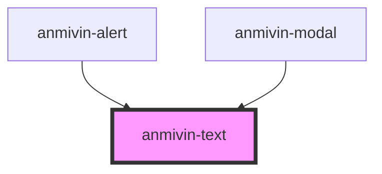

# anmivin-text

<!-- Auto Generated Below -->

## Properties

| Property  | Attribute | Description | Type                              | Default     |
| --------- | --------- | ----------- | --------------------------------- | ----------- |
| `color`   | `color`   |             | `string`                          | `undefined` |
| `variant` | `variant` |             | `"body" \| "subtitle" \| "title"` | `undefined` |

## Dependencies

### Used by

 - [anmivin-alert](../anmivin-alert)
 - [anmivin-modal](../anmivin-modal)

### Graph

----------------------------------------------

*Built with [StencilJS](https://stenciljs.com/)*
